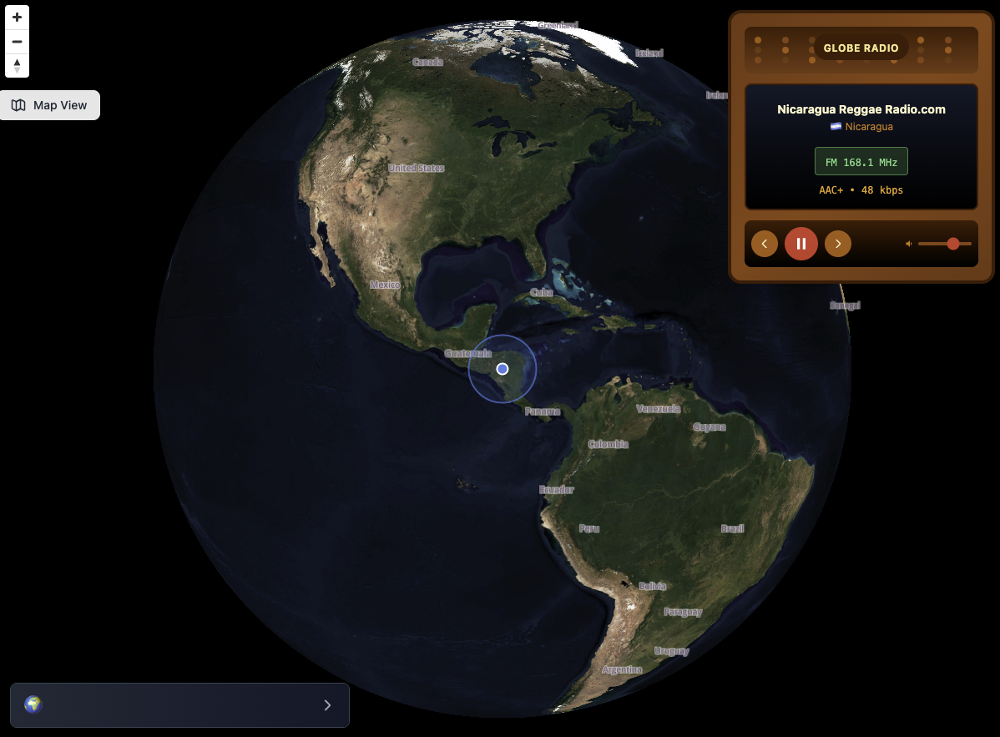

# 🌍 Globe Radio

## 🌐 Languages

- [English](README.md) (current)
- [中文](README-zh.md)

A 3D globe radio application that lets you discover radio stations from around the world by rotating the Earth.



## ✨ Features

- 📍 **Smart Positioning System** - Automatic center crosshair positioning, searches for nearby stations after rotation stops
- 📻 **Global Radio Database** - Integrated Radio Browser API with access to tens of thousands of stations worldwide
- 🎵 **Streaming Playback** - Supports online playback of multiple audio formats
- 🎨 **Retro Radio Interface** - Beautiful retro-style control panel
- ⚡ **Smart Switching** - Automatically displays previous/next buttons based on station count

## 🚀 Quick Start

### Install Dependencies

```bash
npm install
```

### Start Development Server

```bash
npm run dev
```

The application will start at `http://localhost:5174` (will automatically select another port if this one is occupied)

## 📖 User Guide

### Map Controls
1. **Rotate the Globe** - Use mouse drag to rotate the 3D Earth
2. **Zoom** - Use mouse wheel to zoom the Earth view
3. **Toggle Satellite View** - Click the satellite button in the top-left corner
4. **Jump to Random City** - Press `Enter` to instantly travel to a random location

### Radio Controls
1. **Play/Pause** - Click the play button or press `Space`
2. **Previous Station** - Click the previous button or press `←` (Left Arrow)
3. **Next Station** - Click the next button or press `→` (Right Arrow)
4. **Volume Control** - Use the volume slider on the radio interface

### Keyboard Shortcuts
- `Space` - Play / Pause
- `←` - Previous Station
- `→` - Next Station
- `Enter` - Jump to Random Location

> **Note:** Arrow keys are dedicated to station switching and won't navigate the map. Use mouse drag to move the map instead.

## 🌟 Future Improvements
1. Add radio switching simulation with channel search white noise
2. Add random radio station playback
3. Support displaying radio stations on the map

## 📄 License

MIT

## 🙏 Acknowledgments

- [Radio Browser](https://www.radio-browser.info/) - Provides free radio API
