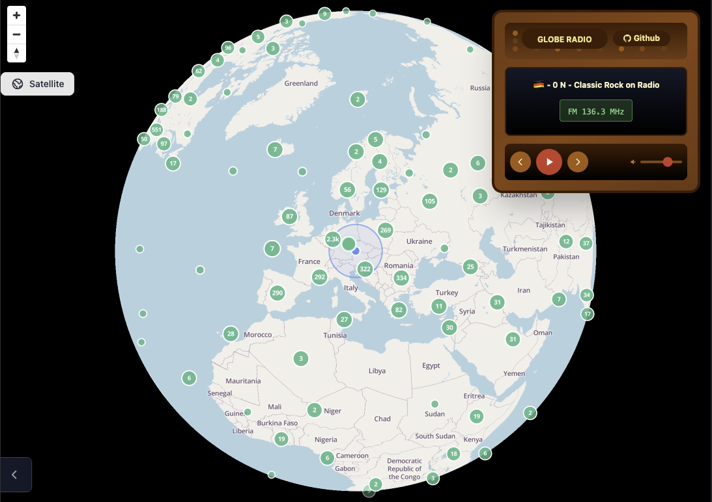

# 🌍 Globe Radio

一个基于 React 的 3D 地球收音机应用，让你通过旋转地球来发现世界各地的电台。



## ✨ 功能特性

- 📍 **智能定位系统** - 中心准星自动定位，旋转停止后搜索附近电台
- 📻 **全球电台数据库** - 集成 Radio Browser API，访问全球数万个电台
- 🎵 **流媒体播放** - 支持多种音频格式的在线播放
- 🎨 **复古收音机界面** - 精美的复古风格控制面板
- ⚡ **智能切换** - 自动根据电台数量显示上/下一个按钮

## 🚀 快速开始

### 安装依赖

```bash
npm install
```

### 启动开发服务器

```bash
npm run dev
```

应用将在 `http://localhost:5174` 启动（如果端口被占用会自动选择其他端口）

## 📖 使用指南

1. **旋转地球** - 使用鼠标拖拽旋转 3D 地球
2. **缩放** - 使用鼠标滚轮缩放地球视图
4. **播放电台** - 点击播放按钮开始收听


## 🌟 未来改进
1. 添加电台切换模拟频道搜索白噪声
2. 增加随机电台播放
3. 支持显示电台到地图上

## 📄 License

MIT

## 🙏 致谢

- [Radio Browser](https://www.radio-browser.info/) - 提供免费的电台 API